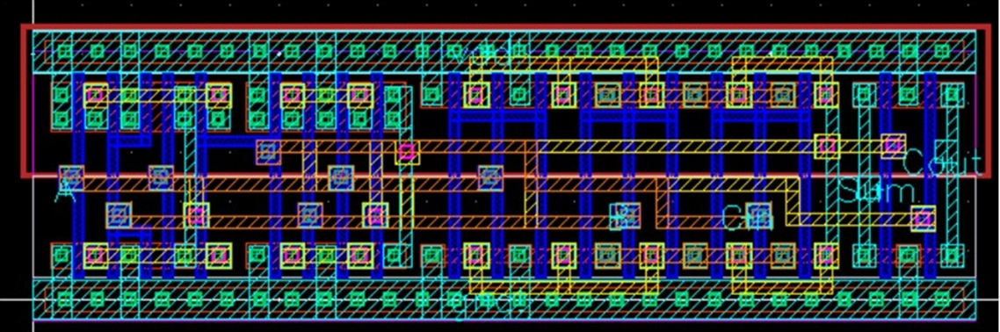
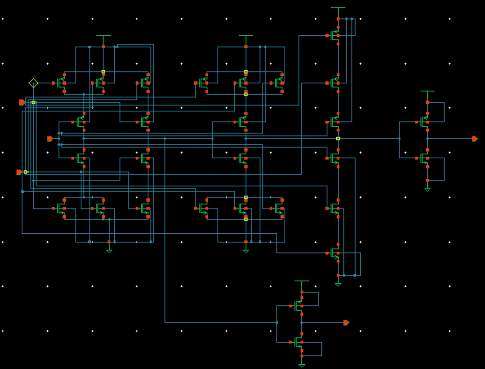

# VLSI Design Projects

This repository contains a collection of VLSI circuit design projects completed as part of graduate-level coursework. The projects cover the complete digital and analog CMOS design flow, including circuit simulation, layout design, parasitic extraction, synthesis, and post-layout timing analysis.

The goal of these projects is to demonstrate practical experience with industry-standard VLSI design methodologies and EDA tools.

---

## Project List

### 1. CMOS Circuit Simulation
**Directory:** `cmos-circuit-simulation`

This project focuses on transistor-level simulation of basic CMOS circuits using SPICE.

Key tasks include:
- CMOS inverter and logic gate simulation
- DC characteristics and transient analysis
- Propagation delay measurement
- Power consumption analysis

Tools:
- HSPICE / SPICE simulator

---

### 2. Basic CMOS Standard Cell Layout
**Directory:** `basic-cmos-standard-cell-layout`

This project implements layout design for basic CMOS standard cells.

Key tasks include:
- Layout design for basic logic gates (INV, NAND, NOR)
- Design rule checking (DRC)
- Layout versus schematic verification (LVS)
- Parasitic extraction (PEX)
- Post-layout simulation

Tools:
- Cadence Virtuoso
- Calibre DRC/LVS
- StarRC / PEX
- HSPICE

---

### 3. Cell-Based VLSI Design Flow (FA, RCA8, MAD32)
**Directory:** `fa-rca8-mad32-synthesis-apr`

This project demonstrates a full **cell-based digital IC design flow**.

Design blocks include:
- Full Adder (FA)
- 8-bit Ripple Carry Adder (RCA8)
- 32-bit Multiply-Accumulate Datapath (MAD32)

Design flow includes:
- RTL synthesis
- standard cell mapping
- automatic placement and routing (APR)
- timing analysis
- post-layout simulation

Tools:
- Logic synthesis tools
- APR tools
- SPICE simulation

---

### 4. 28T Mirror Full Adder Layout
**Directory:** `28t-mirror-full-adder-layout`

This project implements a transistor-level layout of a **28-transistor mirror full adder**.

## 28T Mirror Full Adder

### Layout

### Schematic

Key tasks include:
- transistor-level schematic design
- layout implementation
- DRC/LVS verification
- parasitic extraction
- post-layout delay analysis

Tools:
- Cadence Virtuoso
- Calibre DRC/LVS
- HSPICE

---

## Tools Used

- Cadence Virtuoso
- HSPICE
- Calibre (DRC / LVS)
- StarRC (Parasitic Extraction)
- Standard digital synthesis and APR tools

---

## Topics Covered

- CMOS circuit design
- Standard cell layout
- Design rule checking (DRC)
- Layout versus schematic verification (LVS)
- Parasitic extraction (PEX)
- Post-layout timing analysis
- Digital IC synthesis and APR flow

---

## Author

**Robbie Wei**  
Computer Science  
National Sun Yat-sen University
